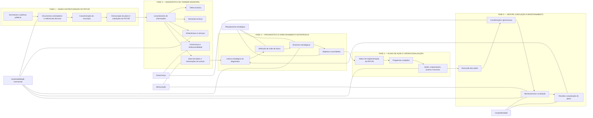

```mermaid
flowchart LR

%% =========================
%% FASE 1
%% =========================
subgraph F1["FASE 1 — BASE E ESTRUTURAÇÃO DO PDTUR"]
direction TB
A1["Normativas e políticas públicas"]
A2["Documentos orientadores e referenciais técnicos"]
A3["Caracterização do município"]
A4["Estruturação do plano e subseções do PDTUR"]
A1 --> A2 --> A3 --> A4
end

%% =========================
%% FASE 2
%% =========================
subgraph F2["FASE 2 — DIAGNÓSTICO DO TURISMO MUNICIPAL"]
direction TB
B1["Levantamento de informações"]
B2["Oferta turística"]
B3["Demanda turística"]
B4["Infraestrutura e serviços"]
B5["Governança e institucionalidade"]
B6["Base de dados e informações do turismo"]
B1 --> B2
B1 --> B3
B1 --> B4
B1 --> B5
B1 --> B6
end

%% =========================
%% FASE 3
%% =========================
subgraph F3["FASE 3 — PROGNÓSTICO E DIRECIONAMENTO ESTRATÉGICO"]
direction TB
C1["Leitura estratégica do diagnóstico"]
C2["Definição de visão de futuro"]
C3["Diretrizes estratégicas"]
C4["Objetivos e prioridades"]
C1 --> C2 --> C3 --> C4
end

%% =========================
%% FASE 4
%% =========================
subgraph F4["FASE 4 — PLANO DE AÇÃO E OPERACIONALIZAÇÃO"]
direction TB
D1["Matriz de Implementação do PDTUR"]
D2["Programas e projetos"]
D3["Ações, responsáveis, prazos e recursos"]
D1 --> D2 --> D3
end

%% =========================
%% FASE 5
%% =========================
subgraph F5["FASE 5 — GESTÃO, EXECUÇÃO E MONITORAMENTO"]
direction TB
E1["Execução das ações"]
E2["Coordenação e governança"]
E3["Monitoramento e avaliação"]
E4["Revisão e atualização do plano"]
E1 --> E2 --> E3 --> E4
end

%% =========================
%% FLUXO ENTRE FASES
%% =========================
A4 --> B1
B6 --> C1
C4 --> D1
D3 --> E1
E4 --> C1

%% =========================
%% DIMENSÕES
%% =========================
G["Governança"]
H["Planejamento estratégico"]
I["Mensuração"]
J["Competitividade"]
K["Sustentabilidade transversal"]

G --- B5
G --- E2

H --- C2
H --- C3
H --- C4

I --- B6
I --- E3

J --- E3
J --- E4

K --- A2
K --- B4
K --- C3
K --- D3
K --- E3
```
