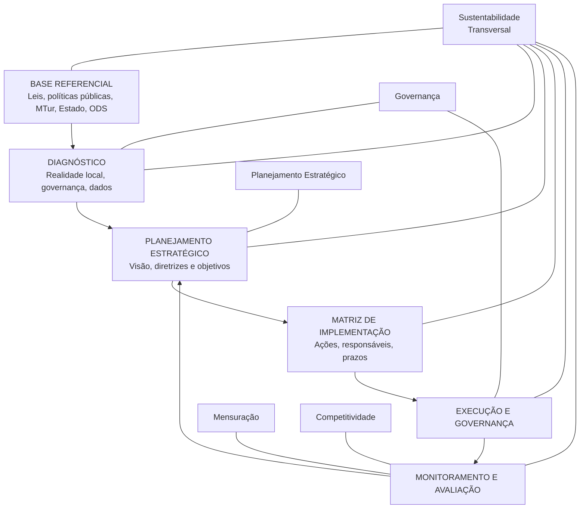

# Framework orientativo para elaboração e gestão do Plano Diretor de Turismo Municipal

```mermaid
flowchart TD

A[BASE REFERENCIAL<br/>Leis, políticas públicas, MTur, Estado, ODS]
--> B[DIAGNÓSTICO<br/>Realidade local, governança, dados]

B --> C[PLANEJAMENTO ESTRATÉGICO<br/>Visão, diretrizes e objetivos]

C --> D[MATRIZ DE IMPLEMENTAÇÃO<br/>Ações, responsáveis, prazos]

D --> E[EXECUÇÃO E GOVERNANÇA]

E --> F[MONITORAMENTO E AVALIAÇÃO]

F --> C

G[Governança]
H[Planejamento Estratégico]
I[Mensuração]
J[Competitividade]
K[Sustentabilidade<br/>Transversal]

G --- B
G --- E
H --- C
I --- F
J --- F

K --- A
K --- B
K --- C
K --- D
K --- E
K --- F
```
