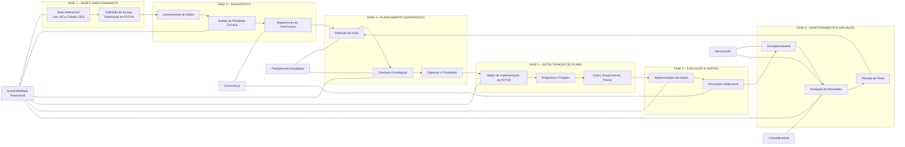

```mermaid
flowchart LR

%% FASES
subgraph F1["FASE 1 – BASE E DIRECIONAMENTO"]
A1[Base Referencial\nLeis, MTur, Estado, ODS]
A2[Definição de Escopo\nDelimitação do PDTUR]
end

subgraph F2["FASE 2 – DIAGNÓSTICO"]
B1[Levantamento de Dados]
B2[Análise da Realidade Turística]
B3[Mapeamento da Governança]
end

subgraph F3["FASE 3 – PLANEJAMENTO ESTRATÉGICO"]
C1[Definição de Visão]
C2[Diretrizes Estratégicas]
C3[Objetivos e Prioridades]
end

subgraph F4["FASE 4 – ESTRUTURAÇÃO DO PLANO"]
D1[Matriz de Implementação do PDTUR]
D2[Programas e Projetos]
D3[Ações, Responsáveis, Prazos]
end

subgraph F5["FASE 5 – EXECUÇÃO E GESTÃO"]
E1[Implementação das Ações]
E2[Articulação Institucional]
end

subgraph F6["FASE 6 – MONITORAMENTO E AVALIAÇÃO"]
F1A[Acompanhamento]
F2A[Avaliação de Resultados]
F3A[Revisão do Plano]
end

%% FLUXO PRINCIPAL
A1 --> A2 --> B1 --> B2 --> B3 --> C1 --> C2 --> C3 --> D1 --> D2 --> D3 --> E1 --> E2 --> F1A --> F2A --> F3A

%% LOOP
F3A --> C1

%% DIMENSÕES
G[Governança]
H[Planejamento Estratégico]
I[Mensuração]
J[Competitividade]
K[Sustentabilidade\nTransversal]

G --- B3
G --- E2
H --- C1
H --- C2
I --- F1A
I --- F2A
J --- F2A

K --- A1
K --- B2
K --- C2
K --- D1
K --- E1
K --- F2A
```
