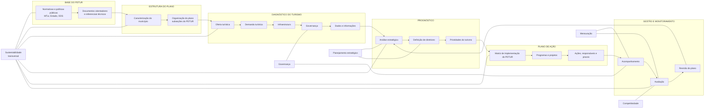

```mermaid
flowchart LR

subgraph F1["BASE DO PDTUR"]
A1["Normativas e políticas públicas<br/>MTur, Estado, ODS"]
A2["Documentos orientadores<br/>e referenciais técnicos"]
end

subgraph F2["ESTRUTURA DO PLANO"]
B1["Caracterização do município"]
B2["Organização do plano<br/>subseções do PDTUR"]
end

subgraph F3["DIAGNÓSTICO DO TURISMO"]
C1["Oferta turística"]
C2["Demanda turística"]
C3["Infraestrutura"]
C4["Governança"]
C5["Dados e informações"]
end

subgraph F4["PROGNÓSTICO"]
D1["Análise estratégica"]
D2["Definição de diretrizes"]
D3["Prioridades do turismo"]
end

subgraph F5["PLANO DE AÇÃO"]
E1["Matriz de Implementação do PDTUR"]
E2["Programas e projetos"]
E3["Ações, responsáveis e prazos"]
end

subgraph F6["GESTÃO E MONITORAMENTO"]
M1["Acompanhamento"]
M2["Avaliação"]
M3["Revisão do plano"]
end

A1 --> A2 --> B1 --> B2 --> C1
C1 --> C2 --> C3 --> C4 --> C5
C5 --> D1 --> D2 --> D3
D3 --> E1 --> E2 --> E3
E3 --> M1 --> M2 --> M3

M3 --> D1

G["Governança"]
H["Planejamento estratégico"]
I["Mensuração"]
J["Competitividade"]
K["Sustentabilidade<br/>transversal"]

G --- C4
G --- M1

H --- D1
H --- D2

I --- M1
I --- M2

J --- M2

K --- A1
K --- B1
K --- C1
K --- D1
K --- E1
K --- M2
```
